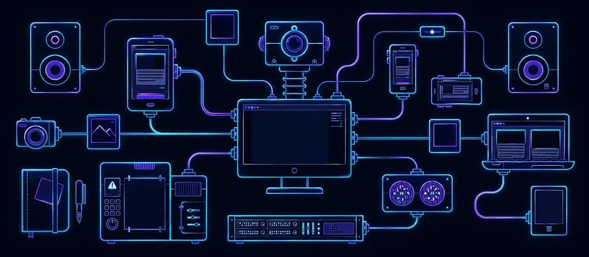

<div align="center">



# 👨‍💻 José Luis Cruz Prieto

### Full-Stack Developer · Automation Engineer · Applied Security Researcher

<a href="https://github.com/Joseluiscruz-hub">
  
</a>

[](https://github.com/Joseluiscruz-hub)
[](mailto:joseluis.cruz@joseluiscruz.me)

<br>


</div>

---

<div align="center">

### 🧭 Navegación rápida

[Sobre mí](#-sobre-mí) · [Impacto](#-impacto-comprobable) · [Stack](#️-stack-tecnológico) · [Proyectos](#-proyectos-destacados) · [Seguridad](#-seguridad-aplicada) · [Estadísticas](#-estadísticas-de-github) · [Contacto](#-trabajemos-juntos)

</div>

---

## 👋 Sobre mí

```typescript
const joseLuis = {
  role: "Full-Stack Developer & Automation Engineer",
  location: "Cuautitlán Izcalli, México 🇲🇽",
  mission: "Convertir problemas operativos complejos en soluciones medibles",

  focus: [
    "Automatización empresarial y optimización de procesos",
    "Aplicaciones web y móviles para operaciones reales",
    "Integraciones SAP, datos y flujos de trabajo",
    "Seguridad de identidad y divulgación responsable",
    "IA aplicada a productividad y productos digitales"
  ],

  principles: [
    "Comprender el proceso antes de automatizarlo",
    "Diseñar con seguridad desde el inicio",
    "Medir el impacto, no solo entregar código",
    "Construir soluciones mantenibles y útiles"
  ],

  status: "Disponible para proyectos freelance y oportunidades remotas"
};
```

Soy un desarrollador orientado a resultados con experiencia directa en operaciones industriales, automatización, SAP y construcción de productos digitales. Mi mayor fortaleza es conectar el problema de negocio con la implementación técnica: analizo el proceso, identifico riesgos, desarrollo la solución y valido su impacto con usuarios reales.

---

## 🏆 Impacto comprobable

<table>
<tr>
<td width="50%" valign="top">

### 💸 Recuperación operativa

Participé en la recuperación de un cierre financiero relacionado con aproximadamente **$800 millones MXN**, mediante ingeniería inversa y automatización de conciliaciones en SAP S/4HANA.

</td>
<td width="50%" valign="top">

### 📱 Digitalización industrial

Diseñé soluciones de inventario móvil que redujeron cerca de **80% los tiempos de captura**, integrando dispositivos industriales, códigos de barras y operación offline.

</td>
</tr>
<tr>
<td width="50%" valign="top">

### ⚙️ Automatización a escala

Construí herramientas con **VBA, Python, SAP GUI Scripting, Power Automate y Excel** para procesar, validar y conciliar grandes volúmenes de información.

</td>
<td width="50%" valign="top">

### 🔐 Investigación de seguridad

Documenté comportamientos anómalos de autenticación y MFA con evidencia técnica, y realicé divulgación responsable mediante Microsoft Security Response Center.

</td>
</tr>
</table>

> Algunas cifras y detalles técnicos se presentan de forma resumida para proteger información confidencial de organizaciones y usuarios.

---

## 🛠️ Stack tecnológico

<div align="center">

<a href="https://skillicons.dev">
  
</a>

<br><br>

**Lenguajes y frontend**


**Backend, cloud y datos**


**Automatización y DevOps**


</div>

---

## 🚀 Proyectos destacados

### 🌐 Productos web y automatización

| Proyecto | Qué resuelve | Tecnologías | Código |
|---|---|---|---|
| 🦺 **Control de EPP** | Gestión empresarial de solicitudes, inventarios, entregas, reposiciones, kiosco y auditoría de equipo de protección personal. | Next.js · TypeScript · Firebase · Cloud Run | [Repositorio](https://github.com/Joseluiscruz-hub/control-de-epp) |
| 🛡️ **Asset Guard Corporate Edition** | Plataforma para gestión y protección de activos empresariales con una experiencia moderna. | TypeScript · React · Web App | [Repositorio](https://github.com/Joseluiscruz-hub/ASSET-GUARD-Corporate-Edition-Advanced) |
| 🧾 **Punto de Venta** | Sistema comercial para administrar productos, existencias, ventas y operaciones de caja. | JavaScript · Web · CI/CD | [Repositorio](https://github.com/Joseluiscruz-hub/Punto-de-venta) |
| ⚖️ **Finiquito Pro MX** | Herramienta enfocada en estimaciones y flujos de cálculo de finiquitos para México. | TypeScript · Next.js | [Repositorio](https://github.com/Joseluiscruz-hub/Finiquito-Pro-MX-v2) |
| 🧠 **DevMentor AI** | Proyecto experimental para aprendizaje, asistencia técnica y desarrollo apoyado por IA. | TypeScript · AI · Web | [Repositorio](https://github.com/Joseluiscruz-hub/devmentor-ai) |
| 🛒 **Mi Tiendita** | Aplicación web ligera orientada a la gestión de una tienda y sus operaciones esenciales. | JavaScript · Web App | [Repositorio](https://github.com/Joseluiscruz-hub/mitiendita) |

### 📱 Sistemas industriales

<table>
<tr>
<td width="50%" valign="top">

#### Inventory Scanner Pro

Aplicación Android para captura y trazabilidad de inventarios mediante códigos de barras y dispositivos industriales.

**Incluye:** operación online/offline, sesiones, ubicaciones, lotes, pallets, movimientos, exportación de datos y compatibilidad con lectores Honeywell.

**Stack:** Kotlin · Jetpack Compose · Room · Hilt · Firebase · MVVM

> Repositorio privado por contener lógica vinculada a procesos operativos.

</td>
<td width="50%" valign="top">

#### Automatización SAP

Conjunto de soluciones para extracción, conciliación, validación y procesamiento masivo de información operativa y financiera.

**Incluye:** SAP GUI Scripting, reportes automatizados, validaciones, conciliaciones y flujos con Excel.

**Stack:** SAP ECC · SAP S/4HANA · VBA · Python · Excel · Power BI

> Los casos se documentan sin revelar información corporativa sensible.

</td>
</tr>
</table>

---

## 🔐 Seguridad aplicada

Mi aproximación a la seguridad parte de evidencia reproducible y divulgación responsable.

- Análisis de flujos de autenticación, MFA, sesiones y tokens.
- Experiencia con Microsoft Entra ID, OAuth 2.0, OpenID Connect, MSAL y JWT.
- Captura y análisis de tráfico mediante Fiddler y PCAPNG.
- Documentación técnica de escenarios, impacto y pasos de reproducción.
- Presentación responsable de investigaciones ante Microsoft Security Response Center.
- Seguridad server-side, control de roles y auditoría en aplicaciones empresariales.

> No publico procedimientos que puedan facilitar abuso ni información que comprometa a terceros.

---

## 🧩 Cómo trabajo


- Diseño desde el problema real, no desde la herramienta.
- Desarrollo incremental con validación temprana.
- Automatización enfocada en eliminar errores y trabajo repetitivo.
- Arquitectura, pruebas, seguridad y mantenibilidad como parte del producto.
- Comunicación clara entre operación, negocio y tecnología.

---

## 📊 Estadísticas de GitHub

<div align="center">


<br>


<br>


</div>

---

## 📚 Actualmente fortaleciendo

- Arquitectura de software y sistemas distribuidos.
- Agentes de IA y automatización inteligente.
- Seguridad de identidades y aplicaciones cloud.
- Pruebas de integración y end-to-end.
- Inglés técnico y conversación profesional.
- Diseño de productos digitales escalables.

---

## 🎯 Objetivo profesional

Busco colaborar en proyectos donde pueda aportar una mezcla poco común de **experiencia operativa, automatización, desarrollo de software y seguridad aplicada**, especialmente en:

- Automatización empresarial y optimización de procesos.
- Desarrollo de aplicaciones industriales.
- Productos web full-stack y plataformas cloud.
- Integraciones SAP y transformación de datos.
- Soluciones con IA aplicada.
- Seguridad de identidad y modernización de sistemas críticos.

---

## 🤝 Trabajemos juntos

<div align="center">

¿Tienes un proceso manual, una operación difícil de controlar o una idea que necesita convertirse en producto?

[](mailto:joseluis.cruz@joseluiscruz.me)
[](https://github.com/Joseluiscruz-hub?tab=repositories)

<br><br>

**Disponible para trabajo freelance, contratos remotos y colaboraciones técnicas.**


</div>
