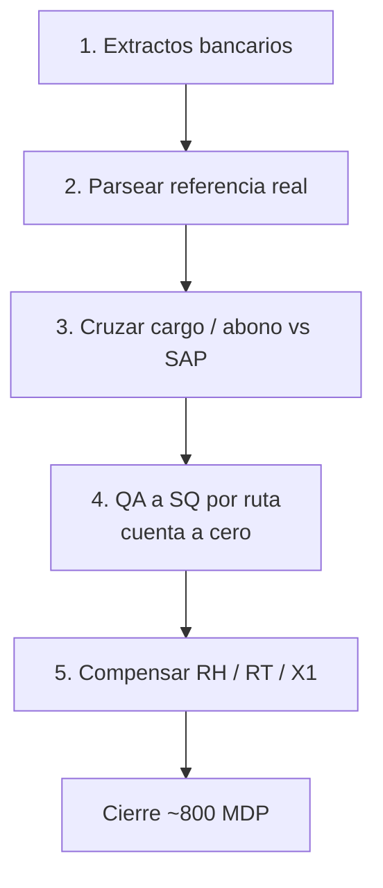

<div align="center">
  
  <h1>José Luis Cruz Prieto</h1>
  <p><strong>De montacargas a un cierre de ~800 MDP</strong></p>
  <p>SAP · planta · apps de operación · Cuautitlán Izcalli, México</p>
  <p>
    <a href="mailto:joseluis.cruz@joseluiscruz.me"></a>
    <a href="https://github.com/Joseluiscruz-hub"></a>
  </p>
</div>

Hace unos años no armaba un Excel. Hoy el trabajo es este: agarrar un proceso que se cayó, escribir el cruce, y no soltarlo hasta que el saldo dé **cero**.

---

## Terracota (SAP Finanzas)

Migración S/4HANA. Cliente y planta no se nombran. Seis meses, cinco fases. Lo difícil no fue “hacer una macro”: fue que el dato no existía en SAP y había que reconstruirlo.



| Fase | Qué hice | Resultado |
|---|---|---|
| 1 | Pago llega a SAP con referencia en ceros. Sacar la referencia del extracto. | Hay llave para cruzar |
| 2 | Matching cargo/abono (fecha, importe, ventana de tolerancia) | Contrapartida localizable |
| 3 | Reemplazar la referencia mala y reclasificar | El doc ya vive en SAP |
| 4 | Por ruta: cargos QA a abonos SQ | Cuenta de ruta en cero |
| 5 | Compensación RH / RT / X1 | Un corte: **410,002 docs**, **~310 MDP a $0.00** |

Macros de ruta: de **~8 h a ~3 h**. El resto de fases no se publica.

El motor de cruce (idea, no el workbook del cliente):

```text
exactos primero (tolerancia chica)
si no hay 1:1 → greedy por proximidad al saldo
misma ventana de fechas
mismo signo
si no entra en tolerancia → rollback, no pintar falso verde
```

---

## Código que sí está en GitHub

No es un CV de badges. Son repos que corren.

<table>
<tr>
<td width="50%" valign="top">

### Asset Guard
CMMS de flota. Angular 19 + Firebase + Gemini.

Taller, SMP, detalle de activo. KPIs de header salen de `DataService`, no de un 98.4% hardcodeado.

[Demo](https://joseluiscruz-hub.github.io/ASSET-GUARD-Corporate-Edition-Advanced/) · [Código](https://github.com/Joseluiscruz-hub/ASSET-GUARD-Corporate-Edition-Advanced)

```ts
readonly fleetAvailability = computed(() => {
  const all = this.assetsSignal();
  if (!all.length) return { percentage: 100, label: 'Excelente' };
  const ok = all.filter(a => a.status.name === 'Operativo').length;
  const percentage = Math.round((ok / all.length) * 100);
  return { percentage, label: percentage >= 90 ? 'Excelente' : 'Alerta' };
});
```

</td>
<td width="50%" valign="top">

### Inventory Scanner Pro
Android. Kotlin + Compose + Room.

Captura física: QR, SAP, TPM, online/offline, comparación en tiempo real.

[Código](https://github.com/Joseluiscruz-hub/InventoryScannerPro)

</td>
</tr>
<tr>
<td width="50%" valign="top">

### Control de EPP
Next.js + Firebase. Kiosco, inventario, vigencias, auditoría.

[Demo](https://control-de-epp.vercel.app) · [Código](https://github.com/Joseluiscruz-hub/control-de-epp)

</td>
<td width="50%" valign="top">

### Punto de venta
Caja y existencias. Catálogo de abarrotes.

[Demo](https://joseluiscruz-hub.github.io/Punto-de-venta/) · [Código](https://github.com/Joseluiscruz-hub/Punto-de-venta)

</td>
</tr>
</table>

También: [Finiquito Pro MX](https://github.com/Joseluiscruz-hub/Finiquito-Pro-MX-v2) · [Mi Tiendita](https://mitiendita-ashen.vercel.app)

---

## Stack que está en esos repos

<div align="center">
  
</div>

<p align="center">TypeScript · Angular · Kotlin · Python · VBA · SAP GUI Scripting · Power BI · Firebase · Azure</p>

---

## MSRC 99279

Investigación de 10+ meses en Entra ID: herencia de sesión TLS entre identidades. Evidencia pcap / Fiddler. MSRC lo cerró como *expected behavior* (4 dic 2025). Sin PoC en este repo.

---

<div align="center">
  
  
</div>

<p align="center">No vendo títulos. Vendo que el número cuadre.</p>
