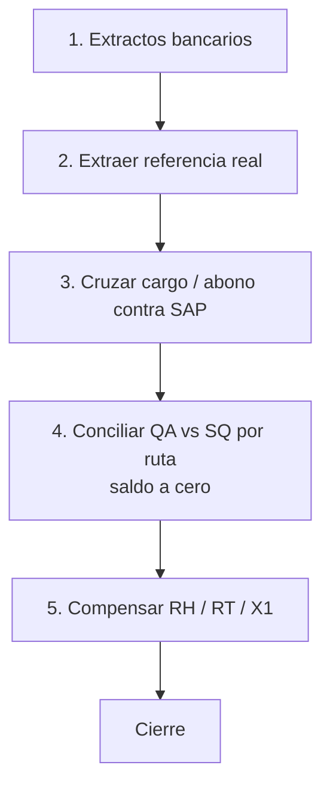

<div align="center">
  

  <h1>José Luis Cruz Prieto</h1>

  <p><strong>Industrial Software · SAP Automation · Mobile Operations</strong></p>
  <p>Construyo software para procesos reales de planta: EPP, inventario físico, CMMS, SAP GUI scripting, conciliación y trazabilidad operativa.</p>
  <p>Cuautitlán Izcalli, México · Disponible para remoto, freelance y proyectos industriales</p>

  <p>
    <a href="mailto:joseluis.cruz@joseluiscruz.me"></a>
    
    
  </p>
</div>

---

## Lo que hago

Construyo la capa de software que falta cuando el proceso real no cabe en una solución estándar. El trabajo suele empezar donde se rompe la operación: inventarios que no cuadran, controles en Excel, SAP sin dato útil, solicitudes en WhatsApp o capturas que cuestan dinero.

Mi forma de trabajar es simple: **entender el proceso, encontrar dónde se rompe y construir hasta que funcione en operación**. No solo entrego pantallas; cierro el ciclo entre el usuario, el dato, la trazabilidad y el sistema que registra la operación.

---

## Ingeniería que puedes ejecutar

No es un CV de badges. Son sistemas, repos y demos que corren.

<table>
<tr>
<td width="50%" valign="top">

### AssetGuard Corporate
**CMMS para gestión de flota · Angular 19 · Firebase · Gemini**

Taller, mantenimiento, ficha detallada por activo y KPIs calculados desde datos reales de la aplicación.

[Demo](https://joseluiscruz-hub.github.io/ASSET-GUARD-Corporate-Edition-Advanced/) · [Código](https://github.com/Joseluiscruz-hub/ASSET-GUARD-Corporate-Edition-Advanced)

```ts
readonly fleetAvailability = computed(() => {
  const all = this.assetsSignal();
  if (!all.length) return { percentage: 100, label: 'Excelente' };

  const ok = all.filter(a => a.status.name === 'Operativo').length;
  const percentage = Math.round((ok / all.length) * 100);

  return {
    percentage,
    label: percentage >= 90 ? 'Excelente' : 'Alerta'
  };
});
```

</td>
<td width="50%" valign="top">

### AssetGuard EPP
**Next.js 15 · React 19 · Firebase · Cloud Run · SAP/MIGO**

Control de EPP con kiosco, inventario, dotaciones, presupuesto, trazabilidad y exportación de layout para baja en SAP.

Piloto de 2 meses en una operación de manufactura en México con más de 500 colaboradores. La solución operó de forma estable durante la validación.

Centraliza solicitud, disponibilidad de stock y preparación del registro SAP. Genera un layout MIGO con material, centro de costo, cantidad, UME, colaborador, área y motivo; incluye validación previa a la contabilización.

[Repositorio](https://github.com/Joseluiscruz-hub/control-de-epp)

</td>
</tr>
<tr>
<td colspan="2" valign="top">

### InventoryScannerPro
**Android · Kotlin · Compose · Room · Firebase**

Inventario físico en planta: escaneo QR, captura offline-first, comparación contra inventario de referencia exportado desde SAP y reportes operativos.

🔒 **Repositorio privado** · arquitectura y demo bajo solicitud.

</td>
</tr>
</table>

También: **Orsted Corp lab** — tenant Microsoft 365 E5 propio de desarrollo y validación (3 años) · Otros: proyectos personales (punto de venta, finiquitos)

---

## Caso destacado · Terracota · SAP Finanzas · Migración S/4HANA

**De montacargas a construir automatización para el cierre.** Cliente y planta no se nombran. Seis meses, cinco fases. El reto no fue solo automatizar: parte del dato necesario para conciliar no existía de forma utilizable en SAP y había que reconstruirlo.



| Fase | Qué hice | Resultado |
|---|---|---|
| 1 | Pago llega a SAP con referencia en ceros. Recuperar la referencia desde el extracto. | Llave útil para el cruce |
| 2 | Matching cargo/abono por fecha, importe y tolerancia | Contrapartida localizable |
| 3 | Reemplazar referencia incorrecta y reclasificar | Documento utilizable en el flujo SAP |
| 4 | Por ruta: cargos QA conciliados contra abonos SQ | Saldo de la ruta llevado a cero |
| 5 | Compensación RH / RT / X1 | En un corte: **410,002 documentos** conciliados y llevados a saldo cero |

Macros de ruta: de **~8 h a ~3 h**. El resto de fases y artefactos del cliente no se publican.

Principio del motor de cruce (sin exponer el workbook del cliente):

```text
exactos primero (tolerancia chica)
si no hay 1:1 → greedy por proximidad al saldo
misma ventana de fechas
mismo signo
si no entra en tolerancia → rollback, no pintar falso verde
```


¿Necesitas automatizar una conciliación, un control de inventario o un proceso SAP que hoy vive en Excel?  
[Escríbeme](mailto:joseluis.cruz@joseluiscruz.me) para revisar el proceso.

---

## Stack

<div align="center">
  <br>
  

  <br><br>

  TypeScript · Angular · Next.js · React · Kotlin · Jetpack Compose · Firebase · Google Cloud Run · Azure · Python · VBA · SAP GUI Scripting · Power BI · GitHub Actions
</div>

---

- **Security research · MSRC 99279:** investigación de más de 10 meses sobre comportamiento de sesión e identidad en Microsoft Entra ID (evidencia de red con pcap y Fiddler). MSRC cerró el caso como *expected behavior* el 4 de diciembre de 2025. No se publican PoC ni materiales sensibles en este perfil.

Lab: tenant E5 propio (Orsted Corp) para desarrollo y para publicar demos sin marca del cliente.

---

<div align="center">
  <p><strong>Convierto procesos rotos en software que sí funciona en operación.</strong></p>
  <p>
    <a href="mailto:joseluis.cruz@joseluiscruz.me">
      joseluis.cruz@joseluiscruz.me
    </a>
  </p>
</div>
