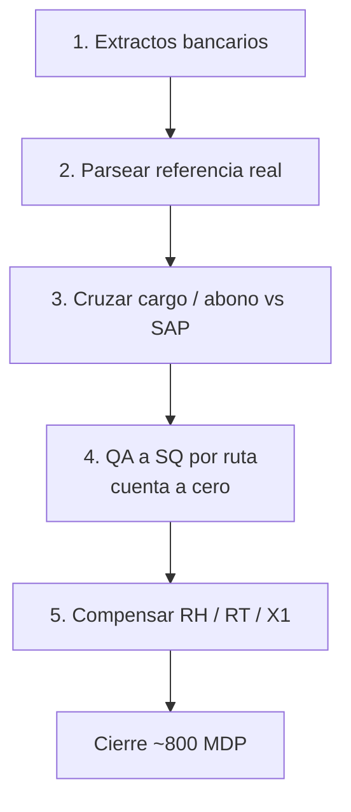

<div align="center">
  

  <h1>José Luis Cruz Prieto</h1>

  <p><strong>Full-Stack Development · Automation · SAP / Operations · Security Research</strong></p>
  <p>Construyo software para procesos reales: web, mobile, automatización y sistemas de operación.</p>
  <p>Cuautitlán Izcalli, México</p>

  <p>
    <a href="mailto:joseluis.cruz@joseluiscruz.me"></a>
    
  </p>
</div>

Construyo software cuando el proceso real no cabe en una solución estándar: desde conciliaciones SAP y automatización operativa hasta aplicaciones web, mobile y herramientas de investigación técnica.

Mi forma de trabajar es simple: **entender el proceso, encontrar dónde se rompe y construir la capa que falta hasta que funcione en operación**.

---

## Ingeniería que puedes ejecutar

No es un CV de badges. Son sistemas, repos y demos que corren.

<table>
<tr>
<td width="50%" valign="top">

### Asset Guard
**CMMS de flota · Angular 19 + Firebase + Gemini**

Taller, SMP, detalle de activo y KPIs calculados desde datos reales de la aplicación.

[Demo](https://joseluiscruz-hub.github.io/ASSET-GUARD-Corporate-Edition-Advanced/) · [Código](https://github.com/Joseluiscruz-hub/ASSET-GUARD-Corporate-Edition-Advanced)

```ts
readonly fleetAvailability = computed(() => {
  const all = this.assetsSignal();
  if (!all.length) return { percentage: 100, label: 'Excelente' };

  const ok = all.filter(a => a.status.name === 'Operativo').length;
  const percentage = Math.round((ok / all.length) * 100);

  return {
    percentage,
    label: percentage >= 90 ? 'Excelente' : 'Alerta'
  };
});
```

</td>
<td width="50%" valign="top">

### Control de EPP
**Next.js + Firebase**

Kiosco, inventario, vigencias, reglas operativas y trazabilidad para entrega de equipo de protección personal.

[Demo](https://control-de-epp.vercel.app) · [Código](https://github.com/Joseluiscruz-hub/control-de-epp)

</td>
</tr>
<tr>
<td width="50%" valign="top">

### Inventory Scanner Pro
**Android · Kotlin + Compose + Room**

Captura física con QR, SAP, TPM, operación online/offline y comparación de inventario en tiempo real.

🔒 **Repositorio privado** · arquitectura y demo disponibles bajo solicitud.

</td>
<td width="50%" valign="top">

### Punto de venta
**Aplicación de caja e inventario**

Catálogo, existencias y flujo de venta para operación de abarrotes.

[Demo](https://joseluiscruz-hub.github.io/Punto-de-venta/) · [Código](https://github.com/Joseluiscruz-hub/Punto-de-venta)

</td>
</tr>
</table>

También: [Finiquito Pro MX](https://github.com/Joseluiscruz-hub/Finiquito-Pro-MX-v2) · [Mi Tiendita](https://mitiendita-ashen.vercel.app)

---

## Featured Case Study · Terracota

### SAP Finanzas · Migración S/4HANA

**De montacargas a un cierre de ~800 MDP.**

Cliente y planta no se nombran. Seis meses, cinco fases. El reto no fue simplemente “hacer una macro”: parte del dato necesario para conciliar no existía de forma utilizable en SAP y había que reconstruirlo.



| Fase | Qué hice | Resultado |
|---|---|---|
| 1 | Pago llega a SAP con referencia en ceros. Recuperar la referencia desde el extracto. | Se obtiene una llave útil para el cruce |
| 2 | Matching cargo/abono por fecha, importe y ventana de tolerancia | Contrapartida localizable |
| 3 | Reemplazar la referencia incorrecta y reclasificar | Documento utilizable dentro del flujo SAP |
| 4 | Por ruta: cargos QA contra abonos SQ | Cuenta de ruta en cero |
| 5 | Compensación RH / RT / X1 | Un corte: **410,002 docs**, **~310 MDP a $0.00** |

Macros de ruta: de **~8 h a ~3 h**. El resto de las fases y artefactos del cliente no se publican.

El principio detrás del motor de cruce, sin exponer el workbook del cliente:

```text
exactos primero (tolerancia chica)
si no hay 1:1 → greedy por proximidad al saldo
misma ventana de fechas
mismo signo
si no entra en tolerancia → rollback, no pintar falso verde
```

---

## Security Research

### Microsoft Security Response Center · MSRC 99279

Investigación de más de 10 meses sobre comportamiento de sesión e identidad en Microsoft Entra ID, con evidencia de red mediante pcap y Fiddler.

MSRC cerró el caso como *expected behavior* el **4 de diciembre de 2025**. No publico PoC ni material sensible en este repositorio.

---

## Stack

<div align="center">
  
</div>

<p align="center">TypeScript · Angular · Next.js · Kotlin · Python · VBA · SAP GUI Scripting · Power BI · Firebase · Azure</p>

---

## GitHub

<div align="center">
  
  
</div>

---

<div align="center">
  <p><strong>Convierto procesos rotos en software que sí funciona en operación.</strong></p>
  <p><a href="mailto:joseluis.cruz@joseluiscruz.me">Hablemos →</a></p>
</div>
